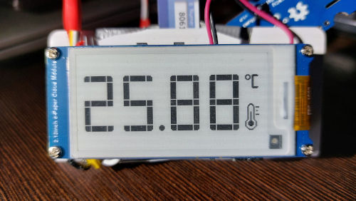

# E-paper thermometer for Home Assistant

## Project features
- Integrates with Home Assistant using WIFI and MQTT. 
- High precision temperature sensor SHT35 is used with precision 0.1 - 0.2 °C
- 2.13inch E-Paper Cloud Module has ESP32 chip and attached battery. The final package is light and small.
  Could be used without external power source. Also could be powered and charged via usb-c without any additional circuits
- Very low power consumption, light sleep mode of ESP32 is used.
- Partial screen refresh function is used. Screen does not flicker, like it does when full refresh is made.
  Other sleep modes (e.g. deep sleep) could be used as well reducing power consumption even more (however I did not manage to avoid screen refreshes after deep sleep wake up).

## Hardware used:
- 2.13inch E-Paper Cloud Module, 250×122, WiFi Connectivity : https://www.waveshare.com/2.13inch-e-paper-cloud-module.htm
- Grove - I2C High Accuracy Temp&Humi Sensor(SHT35) : https://wiki.seeedstudio.com/Grove-I2C_High_Accuracy_Temp%26Humi_Sensor-SHT35/

## Wiring
Since E-Paper Cloud Module contains integrated ESP32, wiring is  pretty easy.  

Please note, that in case of this board, you will have to solder wires to ESP32 chip, since this board does not have gold pins socket, or even an option to mount it.  

## Required libraries:
- 2.13inch e-Paper Cloud Module : https://www.waveshare.com/wiki/2.13inch_e-Paper_Cloud_Module
- Temperature sensor STH35: https://github.com/Seeed-Studio/Seeed_SHT35
- Library for Home Assistant connection: https://github.com/dawidchyrzynski/arduino-home-assistant

## Home Assistant configuration
- Install Home Assistant (HA) : https://www.home-assistant.io/installation/ .
- Install MQTT broker add-on in HA : https://haprofs.com/setting-up-mqtt-mosquitto-broker-home-assistant/
 Use "homeassistant.local" as broker name, note user and password used for connection. 
- Recommended : install: https://mqtt-explorer.com/ . Test if you can make a connection to MQTT broker
  (it will be also useful later for checking if end device is properly sending MQTT messages) 
- When everything is installed and thermometer device is operational and starts sending MQTT messages,
  it will be possible to add entities to HA dashboard using this MQQT broker screen:
  

## Code configuration
- Prepare development environment, e.g. Arduino IDE: https://www.arduino.cc/en/software, set correct board, COM port, etc.
- Enter your WIFI SID and password, MQTT user and password in: [esp32_epaper_temp_hum_mqtt.ino](esp32_epaper_temp_hum_mqtt/esp32_epaper_temp_hum_mqtt.ino)
- You can also modify other setting, e.g. SLEEP_SECONDS, if you want fast reaction in HA for being able to run automation based on temperature reading.
- Modify code of [Temp_Hum_Sensor_Sht_35.cpp](esp32_epaper_temp_hum_mqtt/Temp_Hum_Sensor_Sht_35.cpp) if you use different model of sensor
- Upload code, check logs in serial monitor
- Check if new device is visible in HA/settings/Devices and Services/MQTT
- Then you can add new entities to your dashboard in HA, create automations based on reading, see charts, etc.

## Final effect

### Dashboard in Home Assistant

### Device
Temperature and humidity are shown one after the other. First humidity, then there is 2 seconds delay,
temperature is shown next, following with sleep for 10 seconds. This way power consumption is minimalized.

## How it works
Temperature and humidity values are read using simple API provided by [Temp_Hum_Sensor.h](esp32_epaper_temp_hum_mqtt/Temp_Hum_Sensor.h)
This way it is quite easy to provide implementation for any sensor without modifying main code.
Then if USE_DISPLAY option is set, value are shown on epaper display. Again dedicated API is used here: [Epaper_digits.h](esp32_epaper_temp_hum_mqtt/Epaper_digits.h)
This way all details of epaper maintenance are encapsulated in separate implementation code:  [Epaper_digits.cpp](esp32_epaper_temp_hum_mqtt/Epaper_digits.cpp)
I decided to use custom bitmap fonts for showing 0-9 digits and other symbols (dot, celsius symbol, etc.).
The last part is integration with Home Assistant.
General idea is shown below:

I used this library : https://github.com/dawidchyrzynski/arduino-home-assistant. It sends discovery MQTT messages for all of the sensors
and actual data, when new reading is made.

Example of discovery MQTT message:  

Example of data message:  

